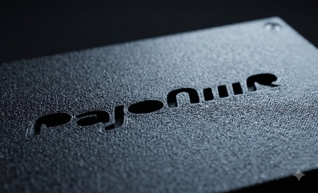

# Pajoniiir BL-A1800

Standalone dual-deck DJ system built around a Pioneer DDJ-FLX4, a Seeed
Studio XIAO ESP32S3 control board and a JC4880P443C_I_W ESP32-P4 multimedia
board. It reads Rekordbox media directly and does not require a PC during
performance.

Canonical repository: `https://github.com/dvucinozd/Pajoniiir.git`. The former
`dvucinozd/ESP32-DDJ-FLX4` URL is deprecated and retained only as a GitHub
redirect. The branch inventory was audited on 2026-07-26; only `master`
remains locally and on `origin`.



> [!IMPORTANT]
> The last matching P4/S3 bench rollout is **`RC1-254-g21f21963`** from
> 2026-07-24. The latest clean ESP-IDF 5.5.4 dual-target release build is
> **`RC1-259-gdaf4639`** from 2026-07-26; it has not been signed, packaged or
> deployed. The active development head is the `migration/esp-idf-6.0.2` branch,
> which migrates both targets to **ESP-IDF v6.0.2** and integrates the full
> `fix/release-blockers-and-concurrency` stabilisation set (bounded compressed
> audio cache, paginated Library UI, immutable track sort, recorder safety
> hardening, lossless control queue, ANLZ ownership fixes and more). All
> software builds, host tests and UI simulator pass on that branch as of
> 2026-07-28; hardware acceptance rows remain open. Repository source is
> therefore newer than installed hardware, and the latest **complete**
> functional hardware baseline remains **`RC1-123-g587cd7a1`** of
> 2026-07-14. See [Documentation Status](docs/DOCUMENTATION_STATUS.md) for
> the precise boundary.

## System at a Glance

| Device | Responsibility |
| --- | --- |
| **Pioneer DDJ-FLX4** | Operator surface: transport, jogs, tempo, mixer, pads, cue and LEDs |
| **XIAO ESP32S3** | USB MIDI host, semantic event translator, LED bridge, FLX4 USB-headphone streamer and service OTA AP |
| **ESP32-P4 board** | Authoritative playback/deck state, Rekordbox library, LVGL UI, audio DSP/mixer and MAIN/cue routing |

The S3 normalizes FLX4 input but does not own playback state. The P4 makes all
authoritative deck, mixer, audio-position and LED decisions. Both boards use
the existing `0xA5` UART control link, extended with the `0xA6` bulk/status
layer. The detailed ownership and data flow are documented in
[Architecture](docs/ARCHITECTURE.md).

## Current Capabilities

- Two independent decks with Rekordbox library browsing and MP3, WAV and FLAC
  playback. Compressed audio uses a bounded LRU page cache (8 × 32 KiB per
  deck) instead of whole-file PSRAM allocation.
- FLX4 transport, jog/vinyl scratch, tempo and Master Tempo, mixer/EQ,
  headphone cue, hot cues, loops, beat jump/sync, Pad FX and Beat FX control.
  Beat FX Filter and Echo have recorded hardware acceptance; Flanger and the
  new one-shot Delay are software-tested and deployed, with focused physical
  audio/routing smoke still pending.
- Simultaneous PCM5102A RCA MAIN output and FLX4 USB headphone cue.
- P4-owned FLX4 LED feedback with reconnect and board-reboot resynchronization.
- LVGL Overview, Library (paginated 8-row table with PREV/NEXT), Hot Cues and
  Settings tabs, plus the optional P4 Wi-Fi remote.
- Data-driven controller profiles loaded from SD or installed through the web
  UI; the built-in DDJ-FLX4 map remains the fallback. The web overwrite path is
  software-complete and still has pending hardware-acceptance rows.
- Signed dual-slot OTA, validation and rollback on both processors.

Detailed implementation and acceptance status belongs in
[Project Overview](docs/PROJECT_OVERVIEW.md),
[Development Plan](docs/DEVELOPMENT_PLAN.md) and
[Documentation Status](docs/DOCUMENTATION_STATUS.md), rather than in this
repository entry page.

## Interface

The captures are representative; small UI details may be newer in firmware.

| Overview | Library | Settings |
| --- | --- | --- |
|  |  |  |

The Hot Cues tab is implemented but does not yet have an archived screenshot.

## Repository Layout

```text
controllers/                 Compiled and source controller profiles
firmware/
  control-board-s3/          ESP32-S3 host/translator/audio-bridge firmware
  main-deck-p4/              ESP32-P4 playback/audio/UI firmware
  common/                    Shared firmware components
docs/                        Product, protocol, validation and design records
tests/                       PC-side regression tests
tools/                       Profile compiler, OTA packager and support tools
```

## Build and Test

Required baseline: **ESP-IDF v6.0.2** and its matching Espressif Python and
toolchain environment. Host tests additionally require native GCC/Make and
PowerShell 5.1 (ili noviji) na Windowsima, odnosno standardni shell na Linuxu.

A standard ESP-IDF installation can be initialized on Windows with:

```powershell
$env:IDF_PATH = "C:\Espressif\frameworks\esp-idf-v6.0.2"
. "$env:IDF_PATH\export.ps1"
```

Verify the selected environment before configuring either target:

```powershell
idf.py --version
```

It must report `ESP-IDF v6.0.2`. For the first build after switching from IDF
5.5.4, remove the previous generated configuration and managed components:

```powershell
Remove-Item -Recurse -Force build, managed_components -ErrorAction SilentlyContinue
Remove-Item sdkconfig, sdkconfig.old -ErrorAction SilentlyContinue
```

Build each target from the repository root:

```powershell
cd firmware\control-board-s3
idf.py set-target esp32s3
idf.py build

cd ..\main-deck-p4
idf.py set-target esp32p4
idf.py build
```

Run the host regression suites from the repository root. These are the same two
entry points CI uses, and both run under Windows PowerShell 5.1 and PowerShell 7:

```powershell
.\tests\run_s3_host_tests.ps1
.\tests\run_p4_host_tests.ps1
```

If `gcc` is not already on `PATH`, append msys2 rather than prepending it —
prepending shadows the system `python.exe` with msys2's, which cannot run the
OTA signing suite:

```powershell
$env:Path = "$env:Path;C:\msys64\ucrt64\bin"
```

Run the headless LVGL navigation and exact-framebuffer screenshot gate:

```powershell
.\tests\ui_simulator\run_ui_simulator_e2e.ps1
```

The first run fetches the pinned LVGL source into the ignored `.cache`
directory. The gate covers Overview Deck 1/2 selection, Library, Hot Cues,
Settings, the screensaver and exact Settings restoration. See
[`tests/ui_simulator/README.md`](tests/ui_simulator/README.md) for baseline
review and update instructions. This PC gate does not replace P4 display,
touch or waveform-motion hardware acceptance.

Both default firmware configurations include the FLX4 USB-headphone path.
Build, flashing, signed release packaging and rollback procedures are covered
by [OTA Update](docs/OTA-UPDATE.md). Hardware bring-up and recurring acceptance
checks are in the [Startup Checklist](docs/STARTUP_CHECKLIST.md).

## Documentation

Start with the [complete documentation index](docs/README.md). The primary
operational documents are:

| Topic | Document |
| --- | --- |
| Product status and source-of-truth policy | [Documentation Status](docs/DOCUMENTATION_STATUS.md) |
| Product shape and implemented scope | [Project Overview](docs/PROJECT_OVERVIEW.md) |
| P4/S3 responsibilities and data flow | [Architecture](docs/ARCHITECTURE.md) |
| FLX4 inputs, outputs and acceptance ledger | [DDJ-FLX4 MIDI Map](docs/DDJ_FLX4_MIDI_MAP.md) |
| UART events and bulk/status transport | [Control Link Protocol](docs/CONTROL_LINK_PROTOCOL.md) |
| Wiring, USB and audio connections | [Hardware Wiring](docs/HARDWARE_WIRING.md) |
| Current phases and remaining engineering work | [Development Plan](docs/DEVELOPMENT_PLAN.md) |
| Open and accepted risks | [Risk Register](docs/RISK_REGISTER.md) |

Controller-profile schema/update guides, OTA records, validation evidence,
historical design decisions and upstream/vendor references are linked from the
documentation index. Dated design records explain intent; they do not override
current firmware or active operational documents.
