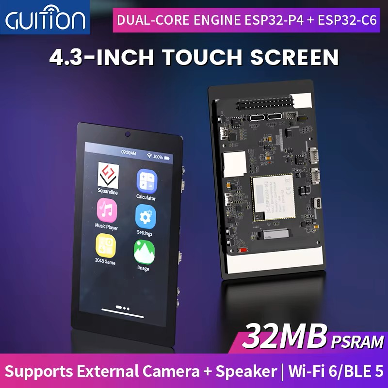
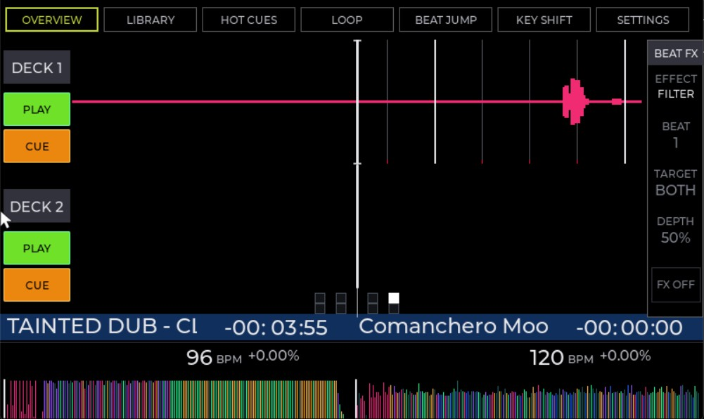
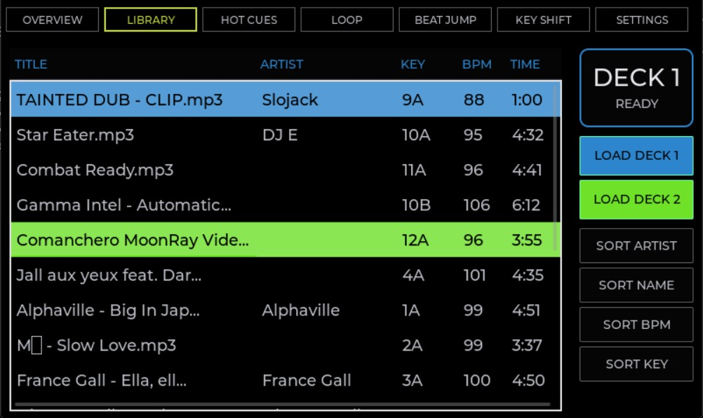
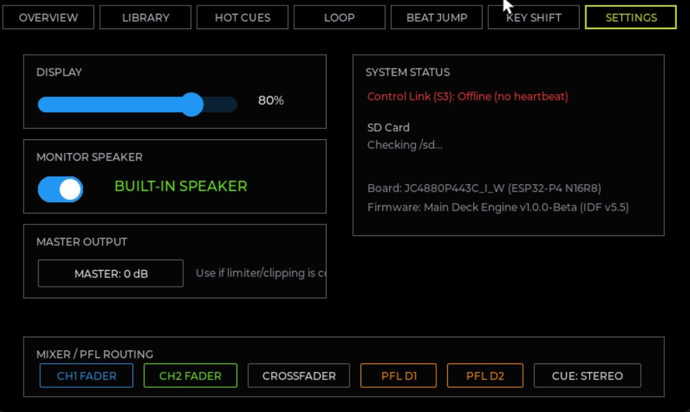

# DDJ-FFL4

Standalone dual-deck DJ system built around a Pioneer DDJ-FLX4 controller, an ESP32-S3 control board, and a JC4880P443C_I_W ESP32-P4 multimedia board.

Current hardware-accepted baseline (2026-07-13): **`RC1-106-g717b6ab3`** on
both processors, `ota_0 / valid`. See the
[documentation status](docs/DOCUMENTATION_STATUS.md) for verified scope and
remaining work.

This repository is a fork-style port of [`dvucinozd/CDJ100S-XXX`](https://github.com/dvucinozd/CDJ100S-XXX). The upstream project already proves the hard platform pieces: ESP32-P4 display and touch, Rekordbox USB library parsing, MP3 preload/decode, ES8311 I2S output, ESP32-S3 support firmware, and the internal `0xA5` UART control link.

DDJ-FFL4 changes the product target:
- The CDJ-100S front panel is replaced by a Pioneer DDJ-FLX4.
- The ESP32-S3 becomes a USB MIDI host and FLX4 protocol translator.
- The ESP32-P4 becomes a two-deck playback, UI, and mixer engine.
- The existing UART `control_link` remains the semantic event bus between the S3 and P4.

---

## 📸 Screenshots & Hardware

### ESP32-P4 Development Board & Display


### Dual-Deck LVGL UI
The active interface has Overview, Library, Hot Cues and Settings tabs. The
repository currently contains representative captures for three tabs; the live
Hot Cues tab is implemented but does not yet have an archived screenshot.

| Overview Screen | Library Navigation |
| --- | --- |
|  |  |
| **Settings & Diagnostics** | **Hot Cues** |
|  | Implemented; screenshot not archived |

---

## 🛠️ Hardware Roles

| Device | Role |
| --- | --- |
| **Pioneer DDJ-FLX4** | Operator surface: transport, jogs, tempo, mixer, cue, pads, LEDs |
| **Seeed Studio XIAO ESP32S3** | USB MIDI host, semantic translator, LED bridge, FLX4 USB-headphone streamer and service OTA AP |
| **JC4880P443C_I_W ESP32-P4** | LVGL UI, Rekordbox media library, two deck states, audio decode, mixer, master/cue output |

---

## 📁 Repository Layout

```text
firmware/
  control-board-s3/   ESP32-S3 FLX4 host/translator/audio-bridge firmware
  main-deck-p4/       ESP32-P4 authoritative dual-deck/audio/UI firmware
docs/
  reference/          vendored upstream and FLX4 mapping inputs
  images/             Screenshots and hardware photos used in documentation
tests/                PC-side test harnesses inherited from CDJ100S-XXX
```

### Key Project Documents
- [Project overview](docs/PROJECT_OVERVIEW.md)
- [Architecture](docs/ARCHITECTURE.md)
- [DDJ-FLX4 MIDI map](docs/DDJ_FLX4_MIDI_MAP.md)
- [Control link protocol](docs/CONTROL_LINK_PROTOCOL.md)
- [Controller profile schema](docs/CONTROLLER_PROFILE_SCHEMA.md)
- [Hardware wiring](docs/HARDWARE_WIRING.md)
- [Development plan](docs/DEVELOPMENT_PLAN.md)
- [Startup checklist](docs/STARTUP_CHECKLIST.md)
- [Risk register](docs/RISK_REGISTER.md)
- [Documentation status and source-of-truth policy](docs/DOCUMENTATION_STATUS.md)
- [OTA update procedure](docs/OTA-UPDATE.md)
- [OTA update plan](docs/OTA_UPDATE_PLAN.md)

### Multi-Controller Platform
The system supports controllers beyond the DDJ-FLX4 through **data-driven
controller profiles** — no firmware rebuild per controller. A profile
(`controllers/<name>/profile.s3bin`, compiled from `profile.json` by
[`tools/controller_profile/compile_profile.py`](tools/controller_profile/compile_profile.py))
goes on the SD/TF card; on boot the P4 scans `/sd/controllers`, and when the
S3 reports a connected controller the matching profile is transferred to the S3
over the UART `0xA6` bulk layer and used to map MIDI in/out. The DDJ-FLX4 is the
first supported profile and its built-in map remains the fallback. See
[Architecture](docs/ARCHITECTURE.md) and [Controller profile schema](docs/CONTROLLER_PROFILE_SCHEMA.md).

---

## 📚 Reference Inputs

- Original upstream README: [docs/reference/CDJ100S-XXX-README.md](docs/reference/CDJ100S-XXX-README.md)
- Mixxx DDJ-FLX4 MIDI mapping XML: [docs/reference/Pioneer-DDJ-FLX4.midi.xml](docs/reference/Pioneer-DDJ-FLX4.midi.xml)
- Official Pioneer DDJ-FLX4 MIDI message list: [docs/reference/DDJ-FLX4_MIDI_message_List.md](docs/reference/DDJ-FLX4_MIDI_message_List.md)
- Existing upstream technical docs remain under [docs/](docs/) and should be treated as the baseline implementation reference unless superseded by the DDJ-FFL4 documents.

---

## 💻 Build Environment

The inherited firmware expects the same baseline environment as CDJ100S-XXX:
- **ESP-IDF** v5.5
- **Python** environment installed by Espressif tooling
- **Native MinGW/GCC** for PC unit tests on Windows

### Typical shell bootstrap:
```powershell
$env:IDF_PATH = "C:\Espressif\frameworks\esp-idf-v5.5\"
. C:\Espressif\Initialize-Idf.ps1
```

### Build Entry Points:
```powershell
# Build S3 firmware
cd firmware/control-board-s3
idf.py build

# Build P4 firmware
cd ..\main-deck-p4
idf.py build
```

> The default build of **both** boards now includes the FLX4 USB-headphone audio
> path (PCM5102A RCA MAIN on the P4, USB Audio Class output on the S3) — a plain
> `idf.py build` produces the sound firmware. The former `sdkconfig.flx4_hp_e2e`
> overlay was folded into each board's `sdkconfig.defaults`.

### Running Host Regression Tests:
```powershell
# P4 tests on Windows
.\tests\run_p4_host_tests.ps1

# S3 tests on Windows
.\tests\run_s3_host_tests.ps1
```

After both OTA-enabled targets have been built with the same version, create a
checked local release directory with:

```powershell
.\tools\package_ota_release.ps1
```

The tool validates target chip IDs, project metadata, slot limits, and matching
versions, then signs and verifies target-specific `.ddjota` bundles plus the
outer release manifest under the ignored `releases/` directory. Raw `.bin`
files are retained for wired recovery only. See the
[OTA update procedure](docs/OTA-UPDATE.md) for operation and the
[OTA design record](docs/OTA_UPDATE_PLAN.md) for acceptance history. Unsigned
OTA and rollback are hardware-accepted; signed-path hardware acceptance is the
remaining Batch 6 step.

---

## 📢 Current Status & Features

The `master` branch contains the complete dual-deck controller path, vinyl
scratch, Master Tempo/key lock, simultaneous PCM5102A MAIN and FLX4 USB
headphone cue, data-driven controller profiles, and hardware-accepted P4/S3
OTA with rollback. The R1 end-of-track drain/replay correction is host-tested,
P4-built and basic hardware-smoked. R2 hardens concurrent PCM timeline reads
used by Master Tempo and guards invalid source-less estimated seeks; its host
tests and P4 build pass, and its initial dual-deck scratch/USB hardware smoke
completed without writer timeout, DWC assert, reboot or PCM-link drop.
R3 hardens both control queues so the newest platter touch/release level cannot
be lost or reordered under saturation; both target builds pass and dual-target
hardware smoke passed on 2026-07-13 after flashing both targets.
R4 hardens OTA service access and status handling: both target APs use WPA2,
invalid duplicate `finish()` calls preserve the authoritative result, and
release packaging aligns signed versions with the ESP image descriptor limit.

> [!WARNING]
> The system is functional on the documented bench hardware, but enclosure
> power/thermal/RF soak, signed-OTA hardware acceptance and production key
> custody/rotation, longer dual-deck key-lock quality testing and selected
> hardware acceptance rows remain before a production release.

### Implemented P4 Features (Audio & UI)
- **Audio Engine & Mixer**:
  - MP3 (minimp3), WAV, and FLAC (dr_flac) playback through a decoder-abstraction layer; all decode from the PSRAM preload buffer.
  - Two independent deck states with mixed 44.1/48 kHz playback.
  - Per-deck source/output sample-rate compensation in the output mixer.
  - PCM5102A MAIN OUT support (verified via both RCA and 3.5 mm jack).
  - Limiter telemetry, clipping diagnostics, and persistent non-boosting Master Trim in Settings (NVS).
- **LVGL User Interface**:
  - Interactive dual-deck layout with Pioneer-style Overview chrome.
  - Compact Overview title strip with remaining-time pill, readable BPM/pitch indicators, centered beat/phase match guide lines, an effect-colour-coded Beat FX rail with a vertical depth meter, non-overlapping deck VU meters, and bounded title/timer invalidations.
  - Waveform loading deferred to Overview scheduler with automatic overlays redraw on track load.
  - Waveform zoom controls via Browse knob (4, 8, 12, 16, 24 beats).
  - Tap-to-seek on both waveforms per deck: the large (zoom) waveform seeks within the visible window, and the mini full-track waveform seeks across the whole track.
  - Settings polish with removed out-of-scope Key Shift UI, retired monitor-speaker switch removed, darker wireless switch states, and compact mixer/PFL status strip.
  - Custom boot splash screen (`PajoNiiiR` in Musieer font).
- **Audio DSP & Mapping**:
  - Three-band channel EQ using FLX4 14-bit EQ knobs.
  - Trim/pregain scaling from FLX4 Trim knobs (center is unity, up to +6 dB boost before limiter).
  - Headphones Mix (14-bit) routed to monitor DSP (blends Cue/PFL with Master).
  - Headphones Level mapped to headphone output gain.
  - Beat FX (three effects, effect-colour-coded on the Overview rail): a resonant one-knob channel **Filter** (exponential low-pass/high-pass sweep to full kill), a tape-style tempo-synced **Echo** (per-generation feedback damping + ring-out tail, 1000 ms safety cap), and a beat-synced **Flanger** (triangle-LFO fractional delay with feedback).
  - Smart CFX applies a smoothstep response curve to the channel filter (fine near the detent, ~1:1 at half turn, precise near full kill).
  - Pad FX: Filter and delay pads with a release tail.
  - Hot Cue: Store, recall, and clear.
  - Loop controls: In/Out, Reloop/Exit, halve/double, Beat Jump, and Beat Loop pads.
  - Beat Sync: BPM-matching and one-shot phase alignment preserving intra-beat offset.
  - Vinyl scratch: forward/reverse audio, paused/CUE scratch, loop wrapping,
    click-free release/re-grab and dual-deck stress validation.
  - Master Tempo/key lock with an Overview `MT` toggle; basic hardware behavior
    accepted, with longer simultaneous-deck quality tuning deferred.

### Implemented S3 Features (USB Host & MIDI Translator)
- **Host Middleware**:
  - Class-compliant USB MIDI host configuration for the Pioneer DDJ-FLX4.
  - Low-priority feedback treatment for VU output to eliminate MIDI INFO logging flood.
  - Batched MIDI OUT (up to 16 USB-MIDI packets per bulk transfer) so full LED snapshots survive the connect-time burst without queue drops.
  - USB Audio Class output streaming for the FLX4 headphone endpoint. The S3 drains the P4 `hp_out` monitor PCM ring into isochronous OUT transfers, tracks the active P4 link sample rate after stream start, and keeps the packetizer aligned with 44.1/48 kHz monitor output.
- **Physical LED Feedback**:
  - LED status updates for Play, Cue, PFL, active loops, Beat Sync, selected pad mode, Hot Cue slot status, and Beat FX ON/OFF.
  - Board-local S3 status LED feedback for FLX4 host modes: disconnected, connected, and MIDI activity states are shown without encoding playback state.
- **Reconnection/Boot Recovery**:
  - Physical reconnection LED resynchronization.
  - S3 refreshes FLX4 LEDs periodically so that a P4-only reboot recovers state without replugging.

---

## 🎯 MVP Target & Milestones

The primary milestone for DDJ-FFL4 is a stable, stand-alone two-deck playback system:
1. **USB Host Setup**: S3 successfully enumerates the DDJ-FLX4.
2. **Translation**: S3 translates Play, Cue, Load, Jog, Tempo, channel faders, crossfader, and headphone cue into `control_link` frames.
3. **Deck States**: P4 manages two independent deck states.
4. **Playback/Mixing**: P4 decodes two tracks and outputs a master mix with Split Mono and Stereo Master headphone cue/PFL routing.
5. **LED Feedback**: P4 reports status back to S3, which synchronizes FLX4 LEDs.
6. **Recovery**: Heartbeat resync allows connection recovery and hot reboot of boards.

---

## 🚀 Extended Controller Plan

Additional controls are implemented based on the vendored Mixxx XML configuration mapping (for MIDI status, message encoding, and 14-bit pairings) and the official Pioneer MIDI message list.
For the full development and acceptance timeline, see
[docs/DEVELOPMENT_PLAN.md](docs/DEVELOPMENT_PLAN.md).

