# Pajoniiir M2.2


[](https://github.com/dvucinozd/Pajoniiir/releases/latest)
[](https://github.com/dvucinozd/Pajoniiir/actions/workflows/esp-idf-6-migration.yml)
[](https://github.com/dvucinozd/Pajoniiir/actions/workflows/pages-user-manual.yml)
[](https://www.espressif.com/en/products/socs/esp32-p4)
[](LICENSE)
[](https://youtu.be/3RuC3cYCGyE)


**A standalone dual-deck DJ system for the Pioneer DDJ-FLX4, powered by a
single ESP32-P4 board.**

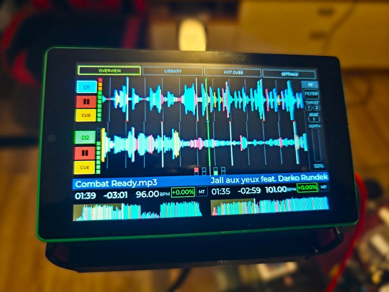

Pajoniiir plays a Rekordbox-exported USB library without a laptop. The
ESP32-P4 hosts both the USB drive and DDJ-FLX4, renders the touchscreen UI,
runs the two playback decks and mixer, and sends MAIN and headphone-cue audio.

- No PC is required during a performance.
- MP3, WAV and FLAC playback is supported.
- Two independent decks provide waveforms, tempo control, Master Tempo,
  Hot Cues, loops, Beat Jump, Sync, Pad FX and Beat FX.
- MAIN audio is available on the PCM5102A RCA output.
- Headphone cue is returned through the DDJ-FLX4.
- Signed local and remote OTA updates are supported.

The current production release is
[`M2.2`](https://github.com/dvucinozd/Pajoniiir/releases/tag/M2.2).

## Hardware

| Part | Purpose |
| --- | --- |
| Guition `JC4880P443C_I_W` | ESP32-P4 board, 4.3-inch touchscreen and main processor |
| Pioneer DDJ-FLX4 | MIDI control surface and four-channel USB audio device |
| Rekordbox USB drive | Music library connected to USB0 |
| PCM5102A DAC | Stereo MAIN output over RCA |
| Regulated 5 V / 3 A or better supply | Common system supply with separately protected USB outputs |
| Pajoniiir enclosure | Printable model and reference renders in [`misc/`](misc/) |

### Parts used

<table>
  <tr>
    <td width="50%">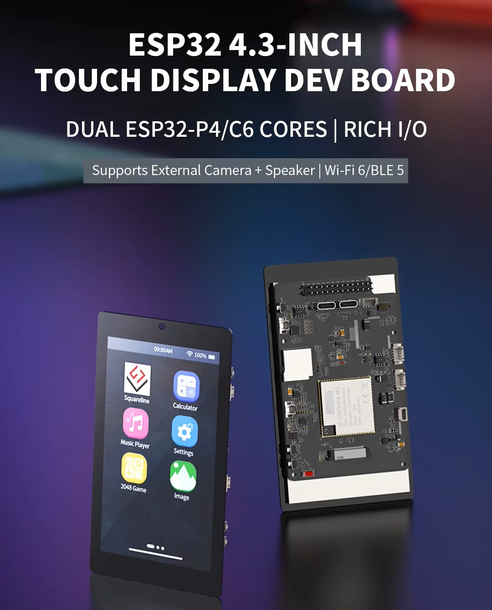</td>
    <td width="50%">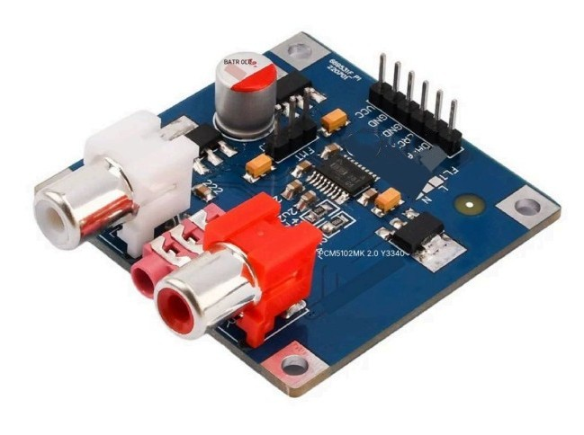</td>
  </tr>
  <tr>
    <td align="center"><sub>Guition JC4880P443C_I_W touchscreen board</sub></td>
    <td align="center"><sub>PCM5102A stereo RCA DAC</sub></td>
  </tr>
  <tr>
    <td>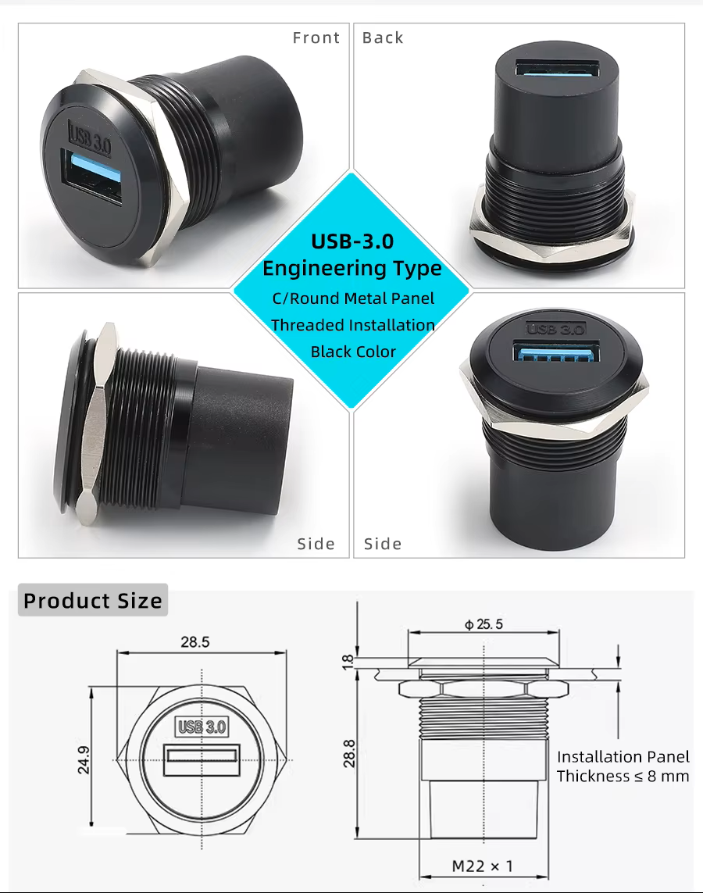</td>
    <td>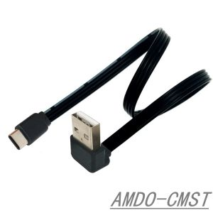</td>
  </tr>
  <tr>
    <td align="center"><sub>Panel-mount USB-A socket for the Rekordbox drive</sub></td>
    <td align="center"><sub>Board-to-panel USB cable</sub></td>
  </tr>
  <tr>
    <td>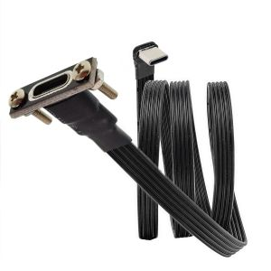</td>
    <td></td>
  </tr>
  <tr>
    <td align="center"><sub>Panel-mount USB-C OTG lead for the DDJ-FLX4</sub></td>
    <td align="center"><sub>Panel-mount USB-C power input</sub></td>
  </tr>
</table>

These are reference photos of the parts used in the build. Seller revisions
and cable pinouts can vary; verify every part electrically and follow the
wiring documentation rather than relying on product photos.

> [!CAUTION]
> USB0 and USB1 must receive safe, current-limited 5 V power. Isolate the
> native P4-side VBUS conductors before injecting protected downstream VBUS.
> Never combine independent supplies with a passive Y-cable. Read the complete
> [hardware wiring and electrical acceptance guide](docs/HARDWARE_WIRING.md)
> before building or changing the power wiring.

## Connect the system

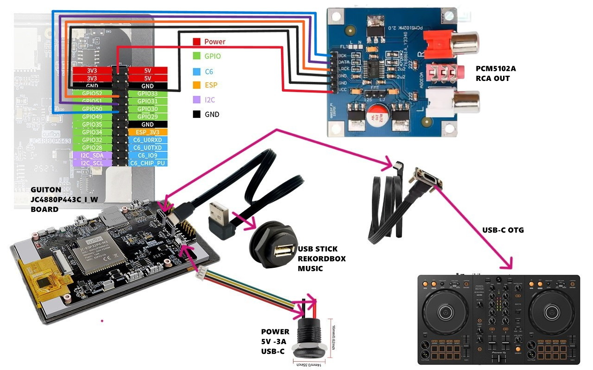

1. With power off, connect the regulated system supply and common ground as
   shown above.
2. Insert the Rekordbox USB drive into **USB0**.
3. Connect the DDJ-FLX4 to **USB1** using the USB-C OTG connection.
4. Connect the PCM5102A RCA output to the MAIN amplifier or powered speakers.
5. Connect headphones to the DDJ-FLX4 if cue monitoring is required.
6. Power on the system and wait for the Library to appear.
7. Browse a track, load it to D1 or D2, and press Play on the controller.

Both USB insertion orders and reconnect recovery have been physically tested.
For connector details and electrical limits, use
[`docs/HARDWARE_WIRING.md`](docs/HARDWARE_WIRING.md) as the source of truth.

## Touchscreen and controller workflow

- **Overview** shows both deck waveforms, transport state, time, BPM, pitch,
  Master Tempo and the active Beat FX.
- **Library** browses the Rekordbox USB collection and loads tracks to either
  deck.
- **Hot Cues** displays and manages performance cue points.
- **Settings** controls device options, diagnostics and Wi-Fi Remote.
- The DDJ-FLX4 controls transport, jog/vinyl, tempo, mixer/EQ, cue, loops,
  Beat Jump, Sync, pads and effects, with LED state restored after reconnect.

## Wi-Fi Remote and updates

1. Enable **Wi-Fi Remote** on the Settings screen.
2. Connect a phone or computer to the `Pajoniiir` Wi-Fi network. The default
   WPA password is `Pajoniiir`.
3. Open [`http://192.168.4.1`](http://192.168.4.1) or
   [`http://pajoniiir.local`](http://pajoniiir.local).

For a local update, upload only the signed `main-deck-p4.ddjota` package. Keep
power stable, stop playback and wait for the device to reboot completely.
Remote releases are published through `https://ota.pajoniiir.eu`.

See the [OTA update procedure](docs/OTA-UPDATE.md) for installation,
verification, rollback and wired-recovery instructions.

## Gallery

<table>
  <tr>
    <td width="50%">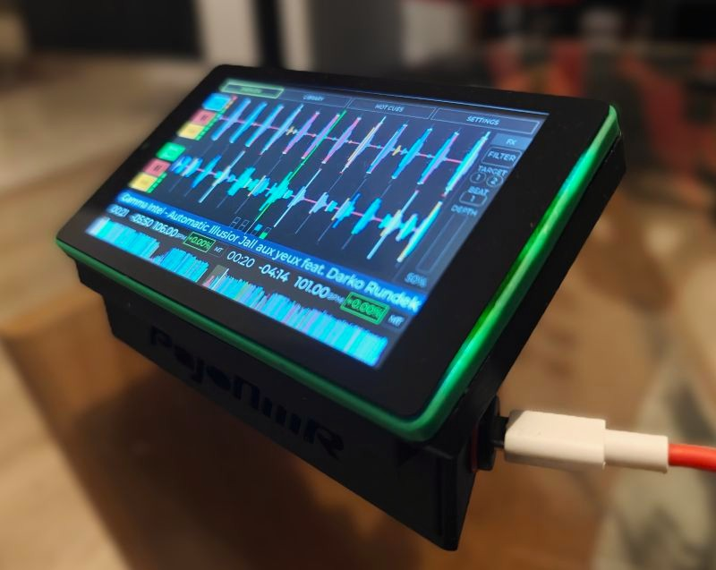</td>
    <td width="50%">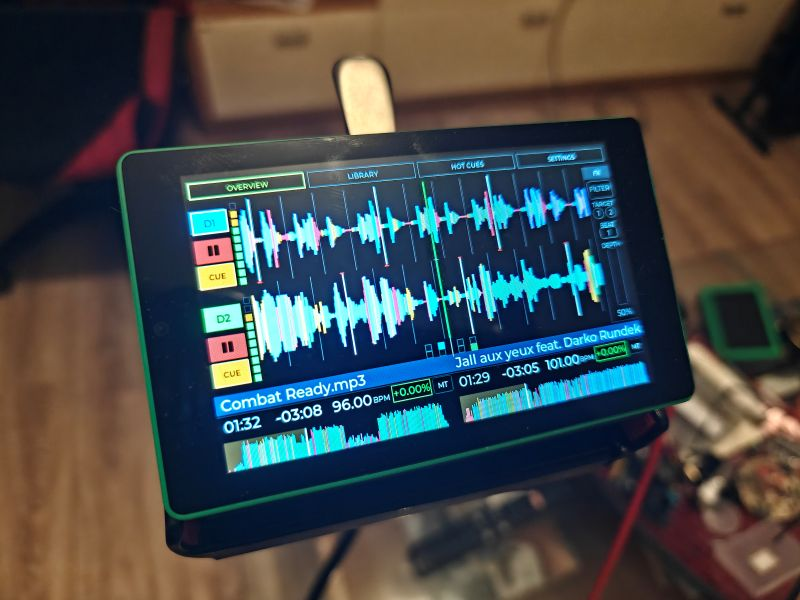</td>
  </tr>
  <tr>
    <td align="center"><sub>Compact standalone player and touchscreen</sub></td>
    <td align="center"><sub>Dual-deck Overview during playback</sub></td>
  </tr>
  <tr>
    <td colspan="2">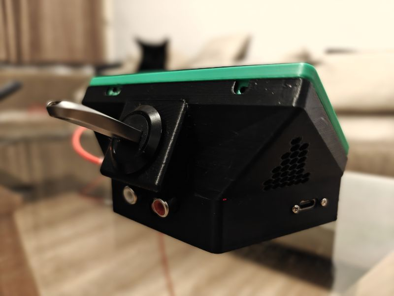</td>
  </tr>
  <tr>
    <td colspan="2" align="center"><sub>Enclosure connections and ventilation</sub></td>
  </tr>
</table>

## DEMO Video

[](https://youtu.be/3RuC3cYCGyE)


## 3D-print enclosure

The printable enclosure and assembly references are stored in
[`misc/`](misc/):

- [`PajoniiirCASE.stl`](misc/PajoniiirCASE.stl) — binary STL ready for slicer
  preparation;
- [`case_anim.gif`](misc/case_anim.gif) — exploded assembly animation;
- `case_assembe.png`, `case_assembe2.png` and `case1.jpg` — assembly and case
  reference views.

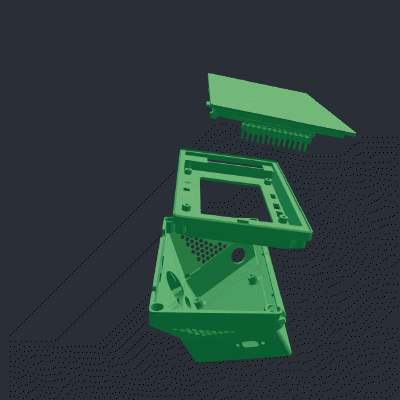

Confirm dimensions, orientation, supports and material settings in your slicer
before printing.

## Build from source

ESP-IDF **v6.0.2** is required.

```powershell
. C:\Espressif\tools\Microsoft.v6.0.2.PowerShell_profile.ps1
idf.py --version  # must report ESP-IDF v6.0.2

$repoRoot = git rev-parse --show-toplevel
Set-Location "$repoRoot\firmware\main-deck-p4"
idf.py build
```

Run the same P4 host regression suite used by CI:

```powershell
Set-Location $repoRoot
$env:Path = "$env:Path;C:\msys64\ucrt64\bin"
.\tests\run_p4_host_tests.ps1
```

Run the headless UI screenshot and navigation gate:

```powershell
.\tests\ui_simulator\run_ui_simulator_e2e.ps1
```

Generated build directories, local `sdkconfig` files, signing keys and release
packages are intentionally excluded from Git. The reproducible dependency lock
at `firmware/main-deck-p4/dependencies.lock` is committed.

## Project status and documentation

`M2.2` is the immutable production release based on commit `2c2ec32`. It adds
the responsive embedded Wi-Fi Remote controller and authoritative SYNC state
while preserving the qualified M2.1 playback, USB and audio baseline. Its exact
tagged ESP-IDF v6.0.2 build, signed OTA installation, hardware/API smoke,
public pull channel and GitHub assets passed. See the
[M2.2 production release report](docs/validation/M2_2_PRODUCTION_RELEASE_20260923.md)
and the inherited
[M2.1 production baseline](docs/validation/M2_1_PRODUCTION_RELEASE_20260920.md).

- [Project overview](docs/PROJECT_OVERVIEW.md)
- [Architecture](docs/ARCHITECTURE.md)
- [Hardware wiring](docs/HARDWARE_WIRING.md)
- [Startup and release checklist](docs/STARTUP_CHECKLIST.md)
- [FLX4 MIDI map](docs/DDJ_FLX4_MIDI_MAP.md)
- [OTA update procedure](docs/OTA-UPDATE.md)
- [Security and provisioning policy](docs/SECURITY_PROVISIONING_POLICY.md)
- [Development plan](docs/DEVELOPMENT_PLAN.md)
- [Risk register](docs/RISK_REGISTER.md)

The active product contains one P4 firmware target:
`firmware/main-deck-p4`. Historical S3 and dual-processor material is available
through Git history and is not part of the current tree or build.

## License

Pajoniiir is available under the [MIT License](LICENSE).
