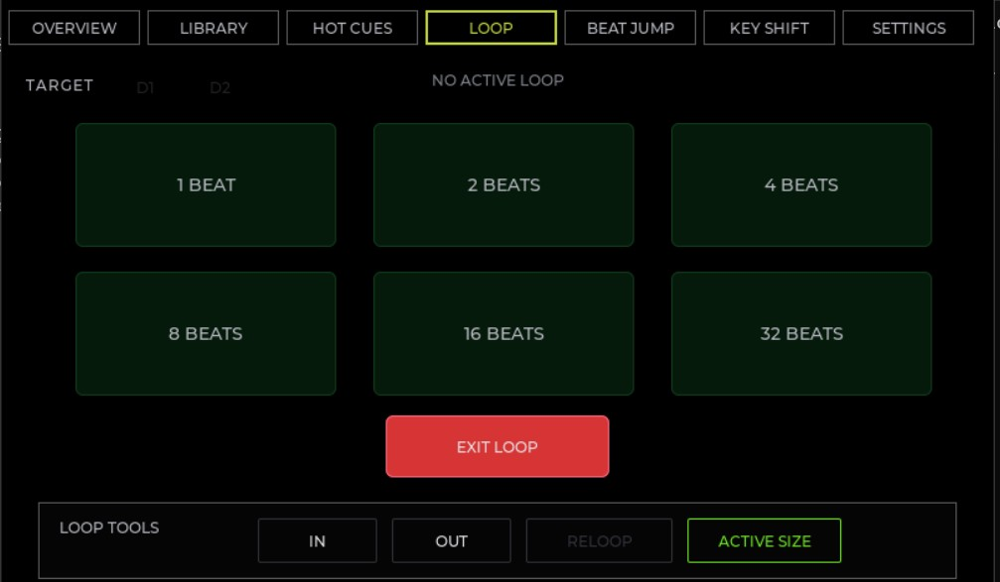

# DDJ-FFL4

Standalone dual-deck DJ system built around a Pioneer DDJ-FLX4 controller, an ESP32-S3 control board, and a JC4880P443C_I_W ESP32-P4 multimedia board.

This repository is a fork-style port of [`dvucinozd/CDJ100S-XXX`](https://github.com/dvucinozd/CDJ100S-XXX). The upstream project already proves the hard platform pieces: ESP32-P4 display and touch, Rekordbox USB library parsing, MP3 preload/decode, ES8311 I2S output, ESP32-S3 support firmware, and the internal `0xA5` UART control link.

DDJ-FFL4 changes the product target:
- The CDJ-100S front panel is replaced by a Pioneer DDJ-FLX4.
- The ESP32-S3 becomes a USB MIDI host and FLX4 protocol translator.
- The ESP32-P4 becomes a two-deck playback, UI, and mixer engine.
- The existing UART `control_link` remains the semantic event bus between the S3 and P4.

---

## 📸 Screenshots & Hardware

### ESP32-P4 Development Board & Display


### Dual-Deck LVGL UI
Below are the screens designed for the two-deck playback interface:

| Overview Screen | Library Navigation |
| --- | --- |
|  |  |
| **Loop Controls** | **Settings & Diagnostics** |
|  |  |

---

## 🛠️ Hardware Roles

| Device | Role |
| --- | --- |
| **Pioneer DDJ-FLX4** | Operator surface: transport, jogs, tempo, mixer, cue, pads, LEDs |
| **ESP32-S3-DevKitC-1 N16R8** | USB MIDI host for FLX4, MIDI-to-control-link translator, LED feedback bridge |
| **JC4880P443C_I_W ESP32-P4** | LVGL UI, Rekordbox media library, two deck states, audio decode, mixer, master/cue output |

---

## 📁 Repository Layout

```text
firmware/
  control-board-s3/   ESP32-S3 firmware inherited from CDJ100S-XXX
  main-deck-p4/       ESP32-P4 firmware inherited from CDJ100S-XXX
docs/
  reference/          vendored upstream and FLX4 mapping inputs
  images/             Screenshots and hardware photos used in documentation
tests/                PC-side test harnesses inherited from CDJ100S-XXX
```

### Key Project Documents
- [Project overview](docs/PROJECT_OVERVIEW.md)
- [Architecture](docs/ARCHITECTURE.md)
- [DDJ-FLX4 MIDI map](docs/DDJ_FLX4_MIDI_MAP.md)
- [Control link protocol](docs/CONTROL_LINK_PROTOCOL.md)
- [Hardware wiring](docs/HARDWARE_WIRING.md)
- [Development plan](docs/DEVELOPMENT_PLAN.md)
- [Startup checklist](docs/STARTUP_CHECKLIST.md)
- [Risk register](docs/RISK_REGISTER.md)

---

## 📚 Reference Inputs

- Original upstream README: [docs/reference/CDJ100S-XXX-README.md](docs/reference/CDJ100S-XXX-README.md)
- Mixxx DDJ-FLX4 MIDI mapping XML: [docs/reference/Pioneer-DDJ-FLX4.midi.xml](docs/reference/Pioneer-DDJ-FLX4.midi.xml)
- Official Pioneer DDJ-FLX4 MIDI message list: [docs/reference/DDJ-FLX4_MIDI_message_List.md](docs/reference/DDJ-FLX4_MIDI_message_List.md)
- Existing upstream technical docs remain under [docs/](docs/) and should be treated as the baseline implementation reference unless superseded by the DDJ-FFL4 documents.

---

## 💻 Build Environment

The inherited firmware expects the same baseline environment as CDJ100S-XXX:
- **ESP-IDF** v5.5
- **Python** environment installed by Espressif tooling
- **Native MinGW/GCC** for PC unit tests on Windows

### Typical shell bootstrap:
```powershell
$env:IDF_PATH = "C:\Espressif\frameworks\esp-idf-v5.5\"
. C:\Espressif\Initialize-Idf.ps1
```

### Build Entry Points:
```powershell
# Build S3 firmware
cd firmware/control-board-s3
idf.py build

# Build P4 firmware
cd ..\main-deck-p4
idf.py build
```

### Running Host Regression Tests:
```powershell
# P4 tests on Windows
.\tests\run_p4_host_tests.ps1

# S3 tests on Windows
.\tests\run_s3_host_tests.ps1
```

---

## 📢 Current Status & Features

The `master` branch is currently up to date and contains the Phase 7 extended-control work, including USB headphone support for the DDJ-FLX4 and official MIDI gap closures. All stale experimental branches have been reviewed, merged where appropriate, and deleted.

> [!WARNING]
> Do not treat the entire system as fully plug-and-play ready for the DDJ-FLX4 yet. Significant progress has been made, but active testing is ongoing.

### Implemented P4 Features (Audio & UI)
- **Audio Engine & Mixer**:
  - Two independent deck states with mixed 44.1/48 kHz playback.
  - Per-deck source/output sample-rate compensation in the output mixer.
  - PCM5102A MAIN OUT support (verified via both RCA and 3.5 mm jack).
  - Limiter telemetry, clipping diagnostics, and persistent non-boosting Master Trim in Settings (NVS).
- **LVGL User Interface**:
  - Interactive dual-deck layout with Pioneer-style Overview chrome.
  - Centered beat/phase match guide lines, fixed-segment timers, and bounded title/timer invalidations.
  - Waveform loading deferred to Overview scheduler with automatic overlays redraw on track load.
  - Waveform zoom controls via Browse knob (4, 8, 12, 16, 24 beats).
  - Custom boot splash screen (`PajoNiiiR` in Musieer font).
- **Audio DSP & Mapping**:
  - Three-band channel EQ using FLX4 14-bit EQ knobs.
  - Trim/pregain scaling from FLX4 Trim knobs (center is unity, up to +6 dB boost before limiter).
  - Headphones Mix (14-bit) routed to monitor DSP (blends Cue/PFL with Master).
  - Headphones Level mapped to headphone output gain.
  - Beat FX: Sync-delay Echo (tempo-derived, 1000 ms safety cap) and low-pass Filter.
  - Pad FX: Filter and delay pads with a release tail.
  - Hot Cue: Store, recall, and clear.
  - Loop controls: In/Out, Reloop/Exit, halve/double, Beat Jump, and Beat Loop pads.
  - Beat Sync: BPM-matching and one-shot phase alignment preserving intra-beat offset.

### Implemented S3 Features (USB Host & MIDI Translator)
- **Host Middleware**:
  - Class-compliant USB MIDI host configuration for the Pioneer DDJ-FLX4.
  - Low-priority feedback treatment for VU output to eliminate MIDI INFO logging flood.
- **Physical LED Feedback**:
  - LED status updates for Play, Cue, PFL, active loops, Beat Sync, selected pad mode, Hot Cue slot status, and Beat FX ON/OFF.
- **Reconnection/Boot Recovery**:
  - Physical reconnection LED resynchronization.
  - S3 refreshes FLX4 LEDs periodically so that a P4-only reboot recovers state without replugging.

---

## 🎯 MVP Target & Milestones

The primary milestone for DDJ-FFL4 is a stable, stand-alone two-deck playback system:
1. **USB Host Setup**: S3 successfully enumerates the DDJ-FLX4.
2. **Translation**: S3 translates Play, Cue, Load, Jog, Tempo, channel faders, crossfader, and headphone cue into `control_link` frames.
3. **Deck States**: P4 manages two independent deck states.
4. **Playback/Mixing**: P4 decodes two tracks and outputs a master mix with Split Mono and Stereo Master headphone cue/PFL routing.
5. **LED Feedback**: P4 reports status back to S3, which synchronizes FLX4 LEDs.
6. **Recovery**: Heartbeat resync allows connection recovery and hot reboot of boards.

---

## 🚀 Extended Controller Plan

Additional controls are implemented based on the vendored Mixxx XML configuration mapping (for MIDI status, message encoding, and 14-bit pairings) and the official Pioneer MIDI message list.
For full details on the development timeline, see Phase 7 of [docs/DEVELOPMENT_PLAN.md](docs/DEVELOPMENT_PLAN.md).

