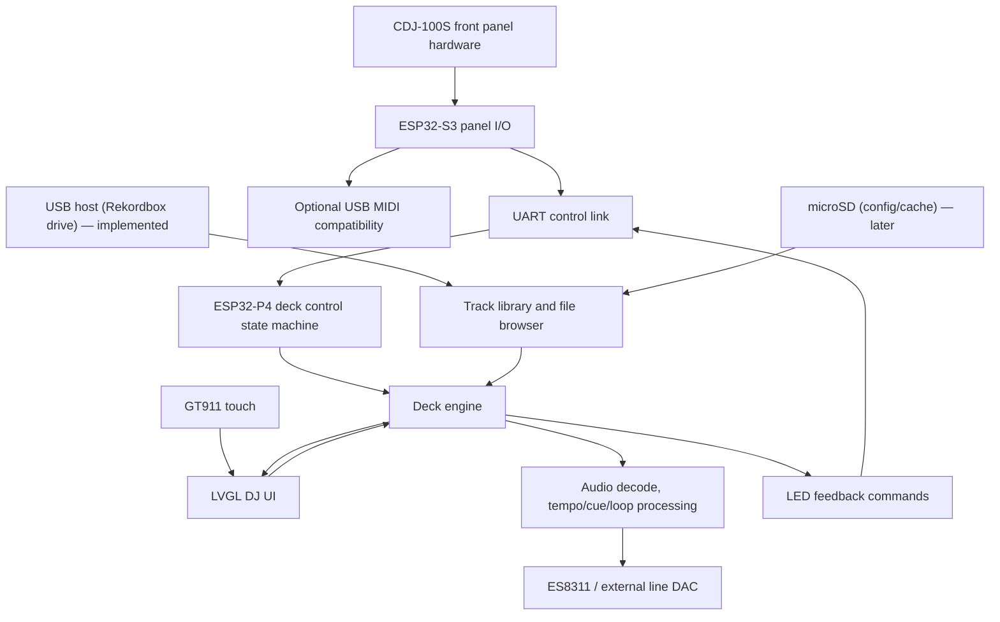

# Porting Architecture

## Recommended Direction

Build a native two-board standalone single-deck player that re-implements the XDJ100SX behavior, instead of trying to run Mixxx on the board.

Reason: the upstream project depends on Linux + Mixxx for the actual deck engine. The JC4880P443C_I_W is an MCU/HMI board, so Mixxx, the Mixxx skin, and the Mixxx JavaScript controller layer cannot be moved over directly. The CDJ front panel also needs more I/O than the P4 board exposes cleanly, so the physical controls move to a dedicated ESP32-S3 control/MIDI board.

## Target System Layers

## Firmware Modules

Proposed source layout for the future firmware:

| ESP32-P4 module | Responsibility |
| --- | --- |
| `bsp_jc4880/` | Board support: display, touch, codec, SD, USB, backlight, power |
| `deck_core/` | Playback state, cue, play, search, loop, beat jump, hot cues |
| `audio_engine/` | Decode, buffering, resampling/time-stretch decision, I2S output |
| `library/` | SD/USB scanning, folder browser, metadata strategy |
| `ui/` | LVGL screens: overview, library, hot cues, beat loop, beat jump, key shift, settings |
| `control_link/` | UART protocol to the ESP32-S3 control board |
| `config/` | Persistent settings, calibration, button map, pitch center |
| `tests/` | Host-side unit tests for state machines and mapping tables where possible |

| ESP32-S3 module | Responsibility |
| --- | --- |
| `panel_io/` | CDJ buttons, jog, browse, pitch fader, LEDs |
| `midi_compat/` | Optional USB MIDI mode matching XDJ100SX mapping for debugging or controller use |
| `control_link/` | UART protocol to the ESP32-P4 main board |
| `calibration/` | Pitch center/range and input calibration |

## Control Strategy

Treat the upstream MIDI map as a stable compatibility map and the ESP32-S3 event protocol as the internal control map:

- Physical control events become named events on the ESP32-S3, not hard-coded Mixxx calls.
- The same action can drive:
  - native ESP32-P4 deck behavior through UART,
  - LED/UI feedback,
  - optional ESP32-S3 USB MIDI compatibility output.

Example:

| Physical event | Action | Native behavior | MIDI compatibility |
| --- | --- | --- | --- |
| Play falling edge | `PLAY_DOWN` | toggle playback | Ch 1 Note 60 on |
| Cue falling edge | `CUE_DOWN` | cue behavior | Ch 1 Note 61 on |
| Jog clockwise | `JOG_TICK +1` | nudge or scratch | Ch 2 CC 20 value 65 |
| Pitch ADC move | `PITCH_ABS` | set playback rate | Ch 1 CC 0/32 14-bit |
| Mode button | `MODE_NEXT` | rotate performance mode | Ch 1 Note 72 |

## Hardware I/O Strategy

Do not wire all CDJ signals directly to the JP1 header. The ESP32-P4 board header does not expose enough free GPIOs and the P4 should focus on display, storage, audio, and UI.

Recommended split:

- ESP32-S3 direct GPIO:
  - jog encoder A/B,
  - browse encoder A/B,
  - buttons,
  - LEDs,
  - pitch ADC if the selected S3 dev board exposes a good ADC pin.
- Optional expander:
  - use only if the chosen ESP32-S3 board lacks enough convenient pins.
- ESP32-P4 JP1:
  - UART link to ESP32-S3,
  - power/ground,
  - optional boot/debug/control signals.

This keeps timing-sensitive controls on a dedicated MCU and removes pressure from the P4 expansion header.

## Audio Strategy

Phase 1 audio should prove simple playback through the built-in ES8311 path using the supplied `mp3_player` example as reference.

For a DJ deck, final audio should target line-level output. We should decide after bench testing:

1. Use ES8311 DAC outputs with a proper output stage if the schematic and measured signal quality are acceptable.
2. Add a small external I2S DAC/line driver for RCA output.
3. Keep speaker output only for development, not final use.

Tempo change, keylock, scratch, and beatgrid-aware loops are high-risk on ESP32-P4. MVP should start without keylock and without full Mixxx-grade time stretching.

## UI Strategy

Rebuild the Mixxx skin in LVGL as a native UI.

MVP UI:

- Landscape `800x480` layout using board rotation.
- Top bar with track title, elapsed/remaining time, BPM, pitch/range, keylock state.
- Central progress overview first, then real decoded waveform overview later.
- Bottom tabs matching upstream: overview, library, hot cues, beat loop, beat jump, key shift, settings.
- Touch input should supplement hardware controls, not replace them.

## Storage Strategy

MVP storage:

- microSD FAT32.
- Folder/file browsing.
- MP3 playback first because the board demo already proves that path.

Later:

- USB mass storage host.
- exFAT if ESP-IDF configuration and licensing constraints are acceptable.
- Metadata cache on SD.
- Rekordbox-style USB parsing only after native playback is solid.

## Build Environment Recommendation

Use ESP-IDF for the production firmware. Arduino is reserved for initial board smoke tests with the vendor examples.

The external repo `upstream/esp32_p4_jc4880p433c_bsp` should be the first BSP candidate for ESP-IDF work. It gives us display, touch, shared I2C, Kconfig, and component dependencies. It does not replace our SD/audio/input/deck modules because SD and codec functions are stubs and there is no CDJ control layer.

Arduino examples are valuable for pin proof and quick experiments, but ESP-IDF gives better control over:

- USB host/device,
- LVGL integration,
- SDMMC,
- I2S codec,
- tasks/cores/latency,
- ESP32-C6 hosted wireless,
- testing and CI.

Arduino can remain a sandbox for the first hardware smoke tests.

## Key Decisions

| Decision | Recommendation | Rationale |
| --- | --- | --- |
| Run Mixxx on board? | No | ESP32-P4 is not a Linux SBC |
| Reuse Mixxx MIDI map? | Yes, as behavioral spec | Preserves upstream control semantics |
| Separate control board? | Yes, ESP32-S3 | Native USB MIDI and enough GPIO for CDJ panel |
| Use LVGL? | Yes | Board examples already use it |
| Use Arduino or ESP-IDF? | ESP-IDF for product, Arduino for smoke tests | Better low-level control |
| Direct-wire controls to P4? | No | Keep P4 focused on UI/audio and avoid GPIO pressure |
| Add I/O expander? | Optional on S3 | Use only if selected S3 board lacks convenient pins |
| Audio path first | Built-in ES8311 | Fastest proof |
| Final audio path | Verify, likely external line DAC/output buffer | DJ line output quality matters |
